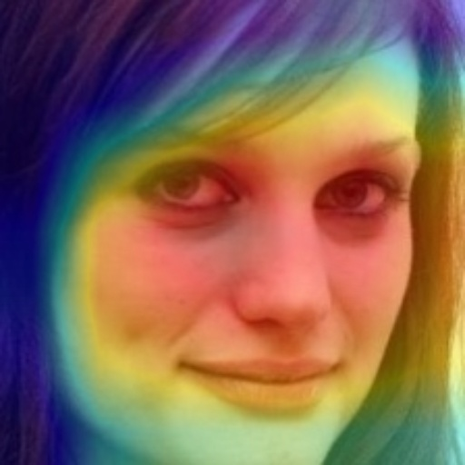
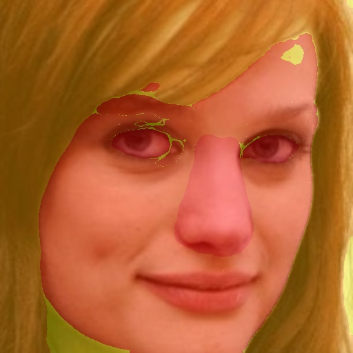
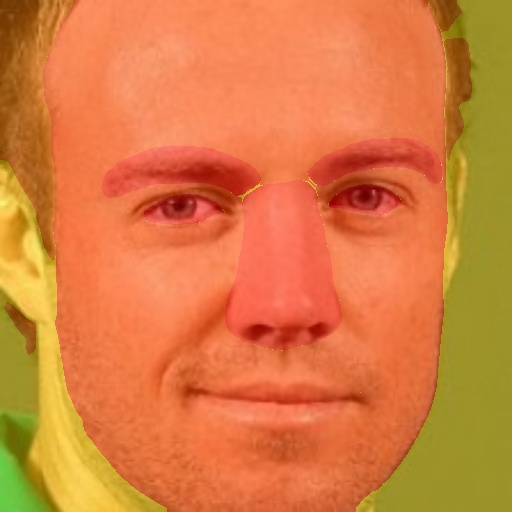

# Facial Attributes Obfuscation


[ACM MM21] Official Code: 

Jingzhi Li, Lutong Han, Ruoyu Chen, Hua Zhang, Bing Han, Lili Wang, Xiaochun Cao:
**Identity-Preserving Face Anonymization via Adaptively Facial Attributes Obfuscation**. ACM Multimedia 2021: 3891-3899


> Note: We received a lot of requests from researchers about the code, so we decided to open source some of the collated code.

## 📰 News & Update

- **[2024.06.05]** We have released the generator and the associated model parameter weights.
- **[2023.06.02]** We have released the verification evaluation metric and some results, please refer to the folder: [Test-Verification](./Test-Verification).
- **[2023.01.14]** We have released some preliminary code.

## 🛠️ Preparation

Please refer to [model_zoo.md](./pretrained/model_zoo.md) to download the pre-trained model to the folder [pretrained](./pretrained/).

Please align all your face images before. If you want to use vggface net, try `mode=vggface`, if you want to use arcface net, try `mode=arcface`. See [tutorial_facealignment.ipynb](tutorial_facealignment.ipynb).

Please refer to the manual of [StarGAN](https://github.com/yunjey/StarGAN) for installation environment

## 🗝️ Stage 1, Identity-aware region discovery

run command:

```
sh stage1.sh
```

than, you can view the results in the saved fold (default is [results](results)). The facial attribute importance sort is writen in a json file like:

```json
{
    "0001_01-0.jpg":{
        "ID":0,
        "ImagePath":"./align_vgg/0001_01-0.jpg",
        "ScoreSort":{
            "nose":0.8627879597363718,
            "eyes":0.8358434626789568,
            "lips":0.7089767999216268,
            "eyebrows":0.6859111387108845,
            "hair":0.2833600649095848
        },
        "AttributePredictedScore":{
            "Receding Hairline":4.573714977595955e-05,
            "Bushy Eyebrows":0.0004814813728444278,
            "Arched Eyebrows":0.9603119492530823,
            "Brown Eyes":0.0012451129732653499,
            "Big Nose":0.00044564614654518664,
            "Pointy Nose":0.9985511898994446,
            "Big Lips":0.710470974445343
        },
        "AvtivatedAttribute":{
            "Pointy Nose":0.8627879597363718,
            "Big Lips":0.7089767999216268,
            "Arched Eyebrows":0.6859111387108845
        },
        "GradCAMPath":"results/vgg_mode/Img/0001_01-0.jpg/0001_01-0-gradcam.jpg",
        "FacePartScorePath":"results/vgg_mode/Img/0001_01-0.jpg/0001_01-0-part-score.jpg"
    },
    ...
}
```

Visualization:

|||
|-|-|
|||
|||

## 🗝️ Stage 2, Identity-aware face obfuscation

After obtaining the most important attribute region, modify according to this region.

The code for the generator is in the [Generator](./Generator) folder.

Train Celeb-A:

```shell
cd Generator
python main.py --mode train --celeba_image_dir data/celeba/images --attr_path data/celeba/list_attr_celeba.txt
```

Test:

```shell
cd Generator
python main.py --mode test --celeba_image_dir data/celeba/images --attr_path data/celeba/list_attr_celeba.txt
```

<!-- In this part, you can directly use the official stargan v2, and combine the results obtained in the first stage for training and testing.

[https://github.com/clovaai/stargan-v2](https://github.com/clovaai/stargan-v2)

If you have any questions about this part of the operation, please contact me. -->

## 👍 Acknowledgement

[StarGAN](https://github.com/yunjey/StarGAN): a single image-to-image translation model.

[Sim2Word](https://github.com/RuoyuChen10/Sim2Word): a explanation method for face verification task.

[FaceTechnologyTool](https://github.com/RuoyuChen10/FaceTechnologyTool): a collection of code commonly used to process face technology, support average face computing, face attributes recognition, face recognition, face segmentation, face verification, and grad-cam for face identification algorithms.

[insightface](https://github.com/deepinsight/insightface): State-of-the-art 2D and 3D Face Analysis Project.

## ✏️ Citation

```bibtex
@inproceedings{li2021identity,
  title={Identity-Preserving Face Anonymization via Adaptively Facial Attributes Obfuscation},
  author={Li, Jingzhi and Han, Lutong and Chen, Ruoyu and Zhang, Hua and Han, Bing and Wang, Lili and Cao, Xiaochun},
  booktitle={Proceedings of the 29th ACM International Conference on Multimedia},
  pages={3891--3899},
  year={2021}
}
```